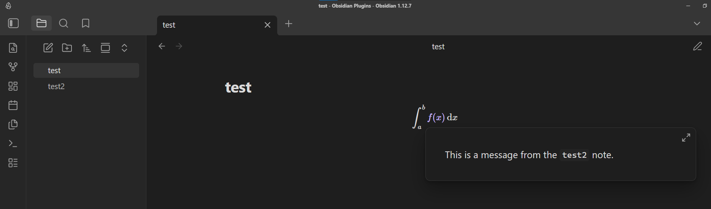

# Obsidian latex internal links plugin

## Purpose

This plugin implements a way to add internal links inside LaTeX expressions with the Page view core plugin.

## How to use it

The idea is the same as implementing external link in LaTeX expressions in Obsidian, using the `\href` command. To add a internal link, it only require to add the prefix followed by a slash `/` in front of the note. By default, the prefix is set to nothing, but it is possible to change it directly in the plugin's option menu.

The way to show the popup (require to press `ctrl` or `cmd` or not) is based on the "Reading view" switch inside the `Page Preview` plugin option.

We can consider the following example with the prefix `in`.

The LaTeX expression is `\int_{a}^{b} \href{in/test2.md}{f(x)} \, \mathrm{d}x`. The `f(x)` expression is an internal link that point to the note `test2`. It also works with inline LaTeX expressions with the simple dollar `$`.

## How does it work ?

The key idea is to exploit the obsidian html class `internal-link` to grab all the features of obsidian's internal links. Using that class makes by default the popup glitch inside LaTeX expressions since obsidian seems to trigger the popup with the `mouseover` event rather than the `mouseenter` event. I decided to block those events when the link is overed.

An other strategy to tackle that problem is to use the core plugin `Page Preview` functions with `registerHoverLinkSource` function (that allows to create a specific switch inside the core plugin's menu) and  trigger the hover event with `this.app.workspace.trigger('hover-link', ...)`. However this requires to implement the whole architecture of internal links.

## Future possible upgrades

For now, the obsidian parse doesn't take into account these kind of links. Thus it won't appear for example in the graph view, the backlinks, ...